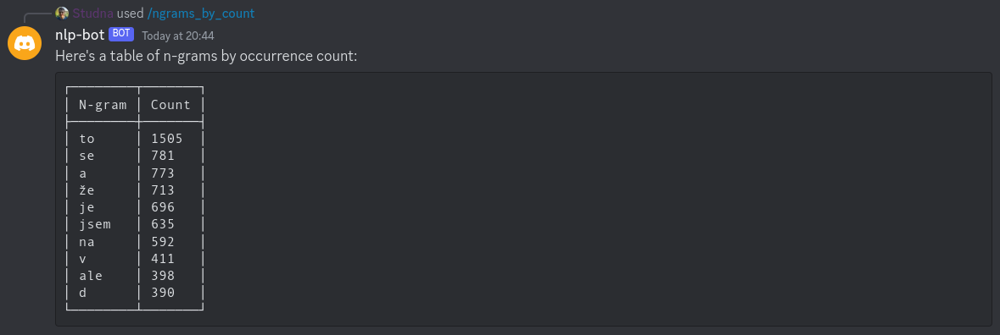

# Discord NLP Bot

A Discord Bot to perform Natural Language Processing (NLP) and related tasks.

## Features

### N-grams

- `/ngrams_by_count`: finding most/least used n-grams
  - By sender
  - By n-gram length
  - By context (channel, server, discord, all)

- `/ngram_by_content`: getting the number of occurrences of an n-gram over time
  - By sender
  - By context (channel, server, discord, all)

## Development

See the [development documentation](./docs/development.md).
